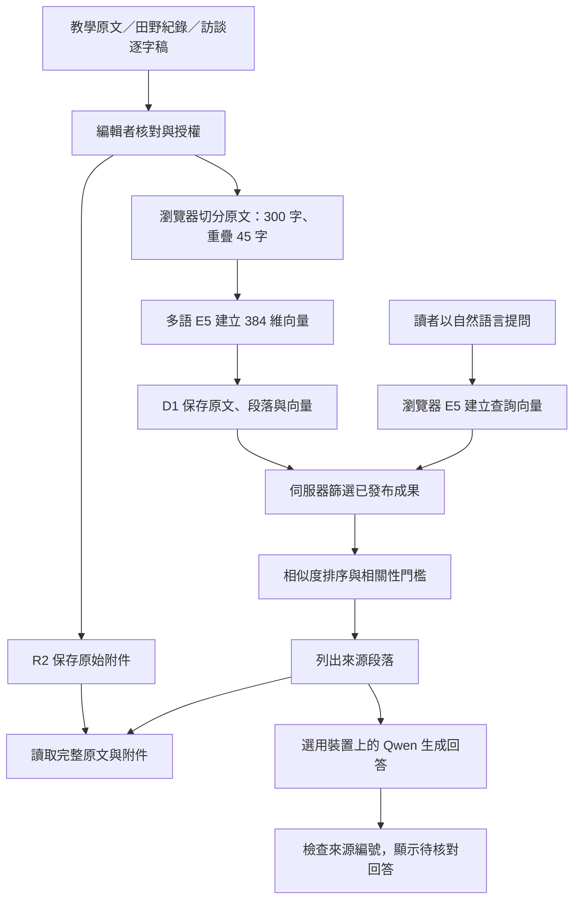

# 系統設計：讓學習成果成為可回查的地方知識

## 使用者與核心工作

教師、學員及田野工作者將課程、走讀、訪談與地方文獻的原文收錄。編輯者確認作者、來源、授權與同意後發布。讀者以自然語言檢索相關紀錄，回到完整原文及附件，必要時請語言模型整理回答。

第一版把公開閱讀與資料收錄分開；網站本身目前由平台限制為私人。共用編輯金鑰限制 API 寫入與草稿讀取，分享網站不會自動授予編輯權限。

## 資料與 RAG 流程

向量模型使用 passage: 與 query: 前綴、mean pooling 及 L2 正規化。兩端必須使用同一模型與維度，避免把不同向量空間混合。伺服器驗證向量維度、有限值、範數、切分內容及模型 ID。

檢索先限制發布狀態、區域、類型與是否包含示範。語意檢索的余弦門檻為 0.84，分數為 98% 語意與 2% 文字比對，再保留距離最高分 0.03 內的來源，最多六段且每份成果最多兩段。這是第一版的經驗門檻，需以正式資料持續評估，不代表可信度百分比。無向量時會清楚標示為關鍵字檢索。

RAG 先選擇最相關的一份成果，最多使用該成果的兩段原文，讓小型裝置模型只整理同一份紀錄。提示要求繁體中文、保留示範標示、忽略來源中的指令，資料不足時承認不足。系統依實際送入模型的段落位置，在每段回答後附上對應 [1] 等來源編號，並移除模型自行生成的編號，避免混淆。這能固定資料來源，無法自動證明摘要每一句都被原文支持；回答仍須與原文核對。

## 資料表

| 表 | 保存內容 | 關係與索引 |
| --- | --- | --- |
| documents | 標題、摘要、原文、地點、類型、記錄者、課程、日期、標籤、網址、授權、同意、發布狀態、示範標示、時間 | 狀態與區域索引 |
| chunks | 原文段落、段落序號、模型 ID、向量 | 外鍵與成果索引 |
| attachments | 檔名、類型、大小、R2 object key | 外鍵與成果索引 |

成果與段落寫入使用 D1 batch 交易。編輯原文後整批替換段落與向量，避免留下舊內容索引。附件先上傳 R2，再寫入 metadata；寫入失敗會移除新物件。移除成果時刪除附件物件，再刪除成果及透過外鍵級聯移除段落與附件中繼資料。

刪除是不可復原的，UI 會再次確認。R2 / D1 不是跨服務交易：若刪除附件後資料庫刪除失敗，需管理員重試；營運前應設定備份與資料恢復流程。

## 來源與授權治理

- 觀察事實、受訪者說法與待查證內容應在原文中清楚區分。
- 日期填實際記錄日期，不使用匯入時間替代。
- 逐字稿保留語言、腔調、時間碼及核對狀態；機器翻譯不可直接當成原話。
- 發布需要資料授權與受訪者同意，敏感資料先匿名化。
- 標示保留所有權利或限教學研究時，讀者仍須依實際授權使用，不能因可下載就假定可轉載。
- 受訪者撤回同意時，編輯者將成果改回草稿，並依營運規範處理原檔及備份。
- 示範紀錄一律與正式成果區分，不虛構調查、受訪者、教學統計或年份。

## API

| Endpoint | 讀寫及授權 |
| --- | --- |
| GET /api/documents | 已發布清單；manage=1 需編輯權限 |
| GET /api/documents/:id | 已發布原文；草稿需編輯權限 |
| POST /api/documents | 編輯者建立成果與索引 |
| PUT /api/documents/:id | 編輯者更新原文、metadata、狀態及索引 |
| DELETE /api/documents/:id | 編輯者刪除成果與附件 |
| POST /api/search | 查詢、可選向量與篩選；僅檢索已發布紀錄 |
| POST /api/documents/:id/attachments | 編輯者上傳附件 |
| GET /api/attachments/:id | 已發布附件；草稿需編輯權限 |
| GET /api/session | 檢查編輯狀態 |
| POST /api/session | 以金鑰建立八小時 cookie |
| DELETE /api/session | 移除瀏覽器編輯 cookie |
| POST /api/demo | 編輯者初始化示範資料，可重複執行不重複新增 |

## 營運與下一階段

第一階段先收錄實際課程與田野成果，由熟悉地方的教師建立人工評估題目。每個題目記錄正確來源、可回答範圍及不應回答的內容，衡量檢索排名與無來源時的行為。

擴大到 2,000 段以上前，改用向量服務並保留相同模型 ID、原文版本及引用關係。多人收錄時再加入個別編輯身分、審核／發布角色與稽核紀錄。影音轉錄、客語逐字稿核對、OCR 及地圖座標可按真實資料需求逐步加入。
